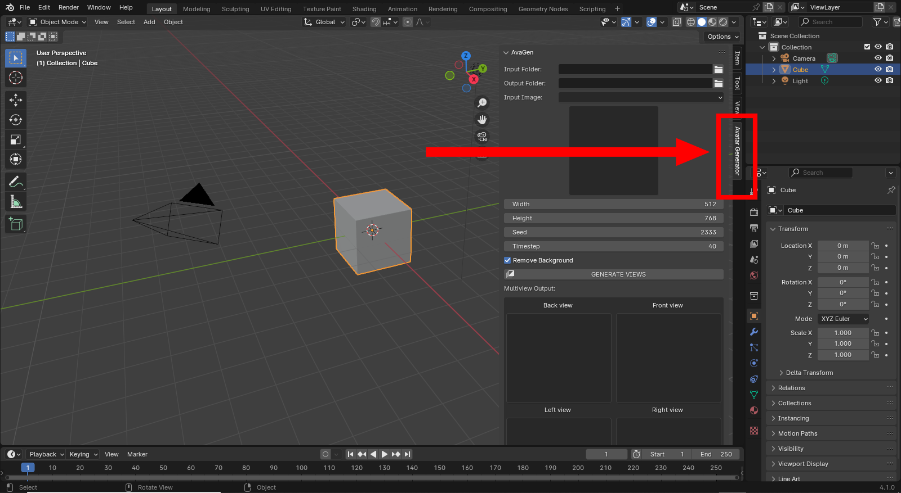

# Installation

This guide covers the process of installing the addon or its trial version.

## Requirements

* Windows, MacOS, Linux
* Blender 4.0+
* A stable Internet connection

## Installation

!!! note

    These instructions work for both the trial version and the complete one. When installing the latter, it is recommended to remove the trial
    version first if you had it installed.

* Launch Blender in **Administrator mode**

!!! warning

    **This is mandatory and only needed for the installation. The following steps won't work if you don't do so.
    Once installed, you won't need to launch Blender in admin mode anymore.**

* Go to "Edit" > "Preferences"
* Switch to the Add-ons tab and click on the "Install..." button at the top-right
* Locate your 3DAvatarGenerator.zip or 3DGenAddonTrial.zip file and double click on it
* Enable the addon by ticking the checkbox

!!! warning

    **Do not use the addon yet! You first need to install the dependencies.**

* Click on the "Install Python Dependencies" button below that appeared just after you ticked the checkbox
* Wait for the dependencies to finish installing 

!!! note

    **A stable Internet connection is required during this step. If it fails, it is most likely due of a connection issue or because you didn't launch Blender in admin mode.**

* Close the Preferences panel after the install finished successfully.
* Close Blender and restart it (at this point, launching in admin mode is not necessary anymore)

If everything worked you should now be able to see an "Avatar Generator" or "Avatar Generator (Trial)" tab in the 3D View's sidebar (press the N key to bring up the latter).

<figure markdown>
  { width="800" }
</figure>

You are now ready to use the addon! Proceed to the [usage section](../how-to-use/views.md) to get started.