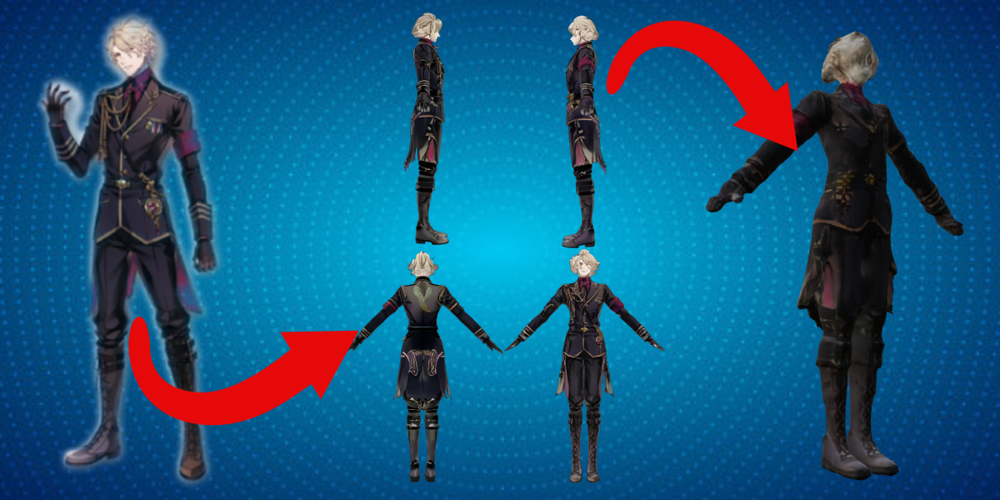

# Overview

Welcome to the Avagen Blender addon wiki! This addon enables you to generate multiple (front, back, left and right) A-pose views and a 3D character model from a single image!

!!! note

    Get it on Blendermarket!

Check out the [Installation instructions](./installation.md) and learn [how to use it](../how-to-use/views.md)!

<figure markdown>
  { width="700" }
</figure>

# Features

- Generate multiple A-pose views (front, back, right, left) from a single image, regardless of the original pose.
- Generate a 3d textured model from these views and directly load it in Blender
- An easy-to-use interface enabling the end-user to fine-tune the available parameters to get the best results and quickly switch between input images.
- All computations done in the cloud, no need for a high-end configuration!

