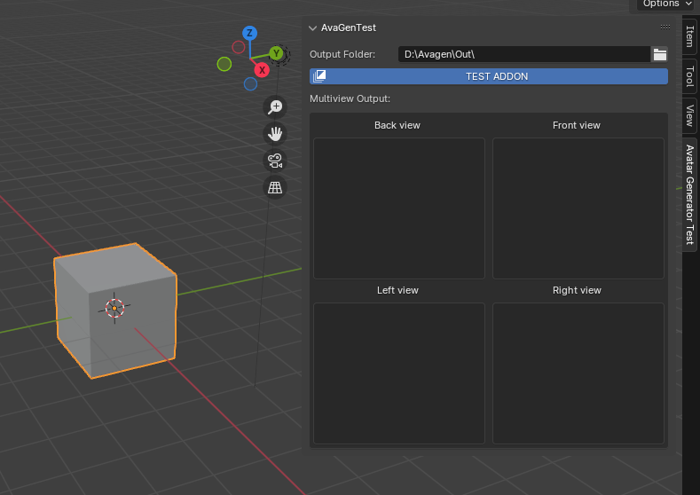
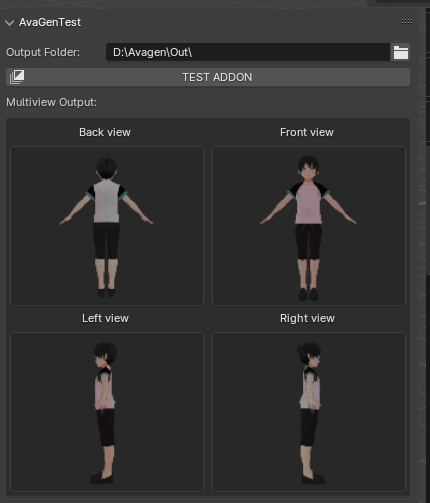

# Trial version

The trial version enables you to test if your setup is compatible with the addon before purchasing. It consists of a simple generation test from an image to see if the whole pipeline is compatible with your environment (OS, VPN, etc.).

* Download it [here](https://github.com/AvagenAddon/wiki/releases/download/v1.0/3DGenAddonTrial.zip).
* Install it by following the instructions in the [Installation page](./installation.md)
* Set the output folder and click on the "Test Addon" button and wait for a few seconds

!!! note

    **A stable Internet connection is required for this step.**

<figure markdown>
  { width="800" }
</figure>

* If everything went well, you should see the following view images loaded:

<figure markdown>
  { width="500" }
</figure>

* If so, that's it! Your current configuration is compatible with the paid version of the addon!

