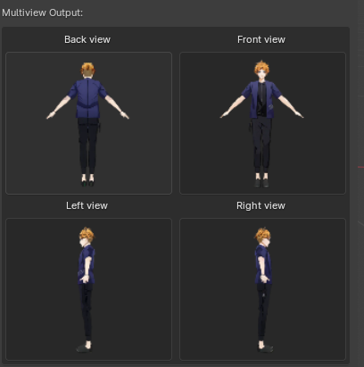
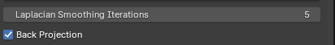
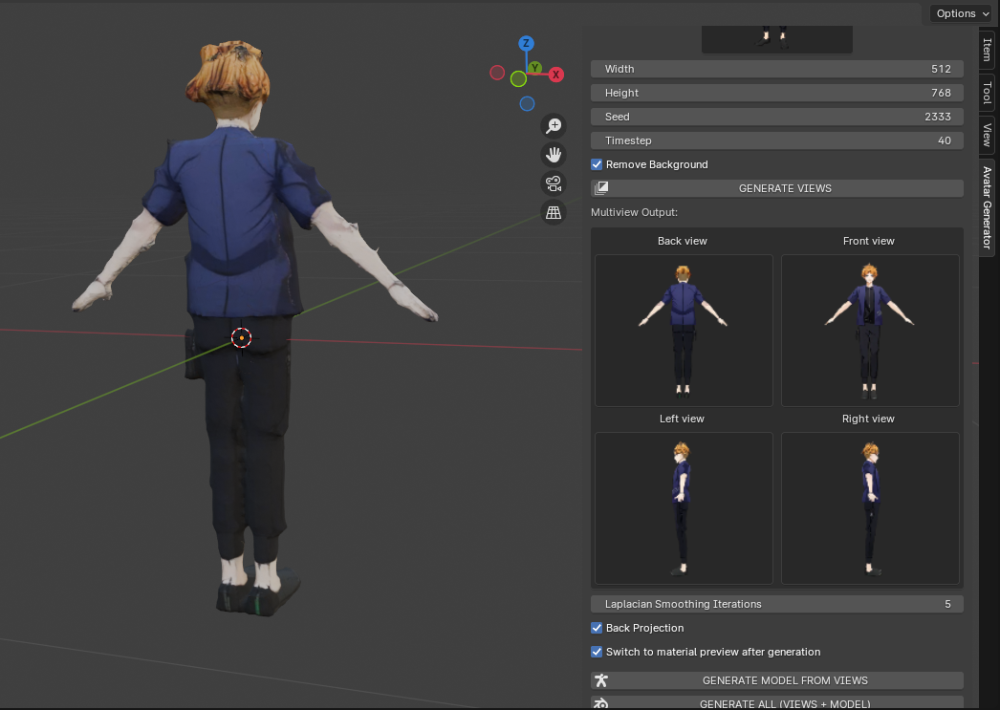

# Generating the model

This page will present you how to generate the 3d model from the multiple (front, back, left, right) A-Pose views.

## Steps

* Make sure that you have the multiple views displayed in the addon tab. If not generate them by following the ["Generating the views" instructions](../how-to-use/views.md).

<figure markdown>
  { width="400" }
</figure>

* Set the parameters (details about these can be found in the [Parameters section ](./#parameters) section)

<figure markdown>
  { width="400" }
</figure>

* Click on the **Generate Model From Views** button and wait a few seconds

!!! note

    **A stable Internet connection is required for this step.**

* Your model will be loaded directly in the viewport!

<figure markdown>
  { width="800" }
</figure>

## Parameters
The following parameters are available for the generation:

#### Laplacian smoothing iterations

The number of iterations used during the smoothing step

#### Back projection

When enabled, back projection will be used for better accuracy during the 3d construction

## Tips

* It is important to have back projection enabled for better results
* The quality of the 4 view images is very important for the quality of the final result. Make sure to try different combinations of parameters.
* You can generate everything at once (views then model) from the input image using the **Generate all** button.