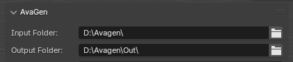
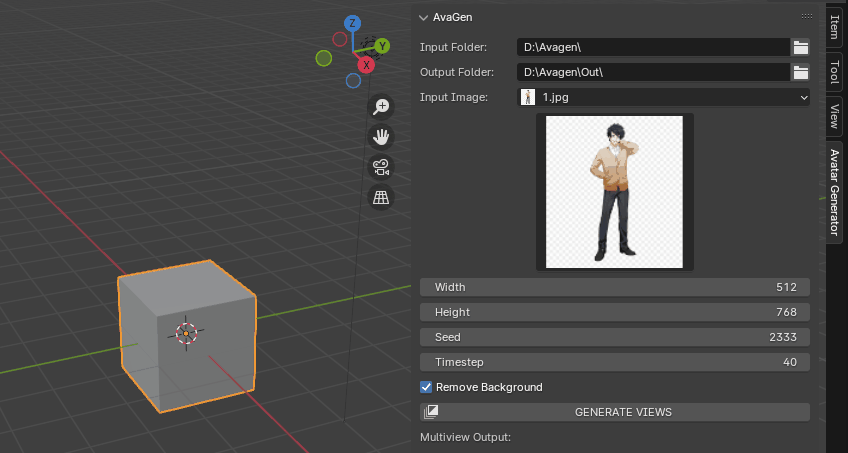
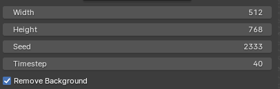
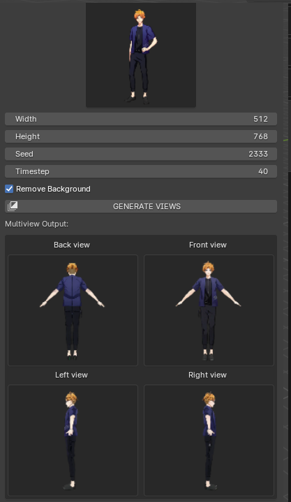

# Generating the views

This page will present you how to generate multiple A-Pose views (front, back, left, right) from an input image.

## Steps

* First of all, set the input folder (the one where your input image is located in) and your output folder (the one where the results will be stored if you want to get the images or the model later).

<figure markdown>
  { width="400" }
</figure>

* After you set your input folder, it will be scanned and you will be able to choose any compatible image it contains as input (the formats supported are .png, .jpg and .webp)

<figure markdown>
  { width="800" }
</figure>

* Set the parameters (details about these can be found in the [Parameters section ](./#parameters) section)

<figure markdown>
  { width="400" }
</figure>

* Click on the **Generate Views** button and wait a few seconds

!!! note

    **A stable Internet connection is required for this step.**

* Your images are now available! They will be shown in the multiview preview just below and will be accessible in your output folder, in a subfolder named with the exact time that you launched the command.

<figure markdown>
  { width="400" }
</figure>

## Parameters
The following parameters are available for the generation:

#### Width

The width of the generated image

#### Height

The height of the generated image

#### Seed

The seed used for the steps involving randomness during the generation process. Trying several different seeds to get the best result is a good idea (remember to note down the ones that gave you the best results!)

#### Timestep

The number of timesteps, a higher number will lead to a more consistent result.

#### Remove Background

When enabled, the background will be remove from the image

## Tips

* Ideally, try having your character on a black background for better results
* Try several sets of seeds during the generation to get the best output possible